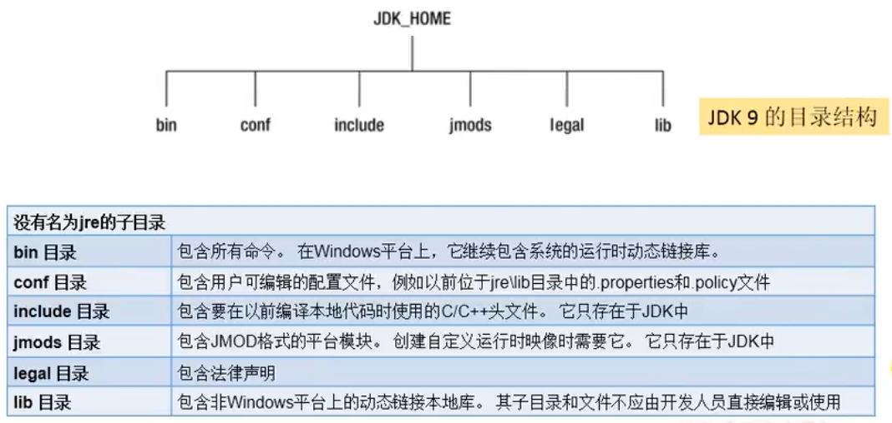
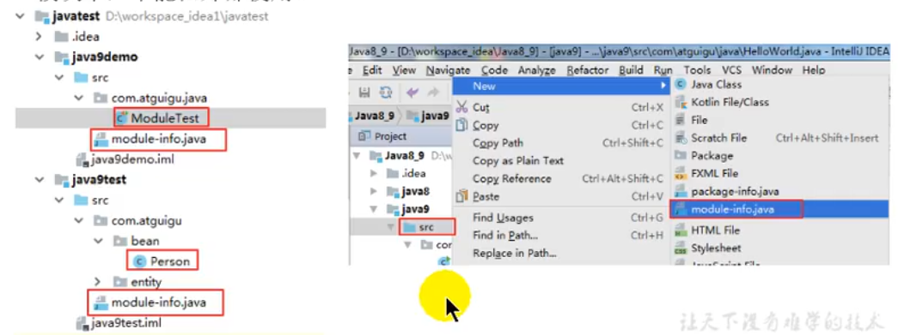

# 十、Java9&10&11的新特性

## 1. JDK9的发布
- 经过4此跳票，历经曲折的Java 9终于在2017年9月21日发布
- 从Java 9这个版本开始，Java的计划发布周期是6个月，下一个Java的主版本将于2018年3月发布，命名为Java 18.3,
接着再过六个月将发布Java 18.9
- 这意味着Java的更新从传统的以特性驱动的发布周期，转变为以时间驱动（6个月的周期）的发布模式，并逐步的将
Oracle JDK原商业特性进行开源。
- 针对企业客户的需求，Oracle将以三年为周期发布长期支持版本（long term support）
- Java 9提供了超过150项新功能特性，包括备受期待的模块化系统、可交互的REPL工具：jshell，JDK编译工具，
Java公共API和私有代码，以及安全增强、扩展提示、性能管理改善等。可以说Java 9是一个庞大的系统工程，完全做了一个整体改变。


### 1.1 Java 9中的一些新特性

1. 模块化系统
2. jShell命令
3. 多版本兼容jar包
4. 接口的私有方法
5. 钻石操作符的使用升级
6. 语法改进：try语句
7. String存储结构的变更
8. 便利的集合特性：of()
9. 增强的Stream API
10. 全新的HTTP客户端API
11. Deprecated的相关API
12. Deprecated的相关API
13. javadoc的HTMD 5支持
14. javaScript引擎升级：Nashorn
15. java的动态编译器




### 1.2 模块化系统: Jigsaw -> Modularity

谈到Java 9大家往往第一个想到的就是Jigsaw项目。众所周知，Java已经发展超过25年（95年最初发布），Java和相关
生态在不断丰富的同时也越来越暴露出一些问题：
1. Java运行环境的膨胀和臃肿。每次JVM启动的时候，至少会有30~60MB的内存加载，主要原因是JVM需要加载rt.jar，
不管其中的类是否被classloader加载，第一步整个jar都会被JVM加载到内存中去（而模块化可以根据模块的需要加载程序需要的class）
2. 当代码库越来越大，创建复杂，盘根错节的“意大利面条式代码”的几率呈指数级增长。不同版本的类库交叉依赖导致让人头疼的问题，
这些都阻碍了Java开发和运行效率的提升。
3. 很难真正地对代码进行封装，而系统并没有对不同部分（也就是JAR文件）之间的依赖关系有明确的概念。每一个公共类
都可以被类路径下任何其它的公共类所访问到，这样就会导致无意中使用了并不想被公开访问的API。
4. 本质上来讲，模块化(Module)的概念，其实就是package外再裹一层，用模块来管理各个package，通过声明某个
package暴露，不声明默认就是隐藏。因此，模块化使得代码组织上更安全，因为它可以指定哪些部分可以暴露，那些部分隐层。
5. 实现目标：
   1. 模块化的主要目的在于减少内存的开销
   2. 只须必要模块，而非全部jdk模块化，可简化各种类库和大型应用的开发和维护。
   3. 改进Java SE平台，使其可以使用不同大小的计算设备
   4. 改进其安全性，可维护性，提高性能。


模块化将由通常的类和新的模块声明文件（module-info.java）组成。该文件时位于java代码结构的顶层，该模块
描述符明确地定义了我们的模块需要什么依赖关系，以及哪些模块被外部使用。在exports子句中未提及的所有包默认情况下
将封装在模块中，不能在外部使用。



### 1.3 Java的REPL工具：jShell命令

1. 产生背景

   像Python和Scala之类的语言早就有交互式编程环境REPL（read - evaluate - print - loop）了，以交互式的方式
   对语句和表达式进行求值。开发者只需要输入一些代码，就可以在编译前获得对程序的反馈。而之前的Java版本要想执行代码，
   必须创建文件、声明类、提供测试方法才可实现。

2. 设计理念

   即写即得、快速运行

3. 实现目标
   
   - Java 9中终于拥有了REPL工具：JShell。让Java可以像脚本语言一样运行，从控制台启动jShell，利用jShell在
   没有创建类的情况下直接声明变量，计算表达式，执行语句。即开发时可以在命令行里直接运行Java代码，而无需创建Java文件，
   无需跟人解释“public static void main(String[] args)”这句废话。
   - jShell也可以从文件中加载语句或者将语句保存到文件中。
   - jShell也可以是tab键进行自动补齐和自动添加分号。

### 1.4 语法改进：接口的私有方法
Java 8中规定接口中的方法除了抽象方法之外，还可以定义静态方法和默认的方法。一定程度上，
扩展了接口的功能，此时的接口更像是一个抽象类。

在Java 9中，接口更加的灵活和强大，连方法的访问权限修饰符都可以声明为private的了，
此时方法将不会成为你对外暴露的API的一部分。

```java
/**
 * @ClassName: PACKAGE_NAME
 * @Description: Java
 * @author: zhilx
 * @version: v1.0
 * @data: 2022/4/17 8:56
 * @node:
 */
public interface MyInterface {
    // 接口中如果不声明，则默认为public权限
    // 如下的三个方法的权限修饰符都是public
    void methodAbstract();

    static void methodStatic() {
        System.out.println("接口中的静态方法");
    }

    default void methodDefault() {
        System.out.println("接口中的默认方法");
    }

    // jdk9 及以后允许接口中定义私有方法
    private void methodPrivate() {
        System.out.println("接口中的私有方法");
    }
}


public class MyInterfaceImpl implements MyInterface{

   @Override
   public void methodAbstract() {
      System.out.println("实现类实现抽象接口");
   }

   // 默认方法可以不用重写，但是抽象方法必须重写
   @Override
   public void methodDefault() {
      System.out.println("实现类重写默认方法");
   }

   public static void main(String[] args) {
      // 1. 接口中的静态方法只能由接口自己调用, 接口的实现类不能调用接口的静态方法
      MyInterface.methodStatic(); // 接口中的静态方法
      // MyInterfaceImpl.methodStatic();

      // 2. 实现类可以调用非静态方法
      MyInterfaceImpl myInterface = new MyInterfaceImpl();
      myInterface.methodAbstract(); // 实现类实现抽象接口
      myInterface.methodDefault();  // 实现类重写默认方法
      // myInterface.methodStatic(); //error, 不可以调用静态方法
      // myInterface.methodPrivate(); // error，不可以调用私有方法
   }
}

```

### 1.5 语法改进：钻石操作符使用升级
我们将能够与匿名实现类共同使用钻石操作符（diamond operator） 在Java 8中如下的操作是会报错的：
```java
public class Java9Test {
   // java9特性五：钻石操作符的升级
   // 钻石操作符与匿名内部类在Java 8中不能共存，在java 9中可以
   @Test
   public void test2() {
      // 在java 8中如果使用匿名内部类，则必须指明操作的类型：Comparator<Object> com = new Comparator<Object> () {...}
      // 否则会：编译报错信息：Cannot use "<>" with anonymous inner classes
      // 在java 9中可以不用指明操作的类型，因为java 9中对其进行了升级
      Comparator<Object> com = new Comparator<>() {
         @Override
         public int compare(Object o1, Object o2) {
            return 0;
         }
      };

      // jdk7 中的新特性：类型推断
      ArrayList<String> list = new ArrayList<>();
   }
}
```

### 1.6 改进语法：try语句
Java 8中，可以实现资源的自动关闭，但是要求执行后必须关闭所有的资源必须在try子句中初始化，否则编译不通过。
如下例所示：
```java
try(InputStreamReader reader = new InputStreamReader(System.in)) {
    // 读取数据代码
} catch (IOException e) {
    e.printStackTrace();    
}
```

```java
public class Java9Test {
    // java9特性六：try操作的升级
    // java8 之前资源关闭的操作，在finally中进行关闭
    public static void tryTest() {
        InputStreamReader reader = null;
        try {
            reader = new InputStreamReader(System.in);
            char[] cbuf = new char[20];
            int len;
            while ((len = reader.read(cbuf)) != -1) {
                String str = new String(cbuf, 0, len - 1);
                if ("e".equalsIgnoreCase(str) || "exit".equalsIgnoreCase(str)) break;
                System.out.println(str);
            }
        } catch (IOException e) {
            e.printStackTrace();
        } finally {
            if (reader != null) {
                try {
                    reader.close();
                } catch (IOException e) {
                    e.printStackTrace();
                }
            }
        }

    }

    // java 8中关闭资源的操作，此时会自动的关闭资源
    // java 8中，可以实现资源的自动关闭，但是要求执行后必须关闭的所有资源必须在try子句中初始化，否则编译不通过
    public static void tryTest2() {
        try (InputStreamReader reader = new InputStreamReader(System.in)) {
            char[] cbuf = new char[20];
            int len;
            while ((len = reader.read(cbuf)) != -1) {
                String str = new String(cbuf, 0, len - 1);
                if ("e".equalsIgnoreCase(str) || "exit".equalsIgnoreCase(str)) {
                    break;
                }
                System.out.println(str);
            }
        } catch (IOException e) {
            e.printStackTrace();
        }
    }

    // java 9中关闭资源的操作
    // java 9中，用资源语句编写try将更容易，我们可以在try子句中使用已经初始化过的资源，此时的资源是final的
    // 此时的资源属性是一个final常量，因此不可以修改
    public static void tryTest3() {
        InputStreamReader reader = new InputStreamReader(System.in);
        OutputStreamWriter writer = new OutputStreamWriter(System.out);
        try (reader; writer) {
            char[] cbuf = new char[20];
            int len;
            // read()方法在读取的时候会把回车符当成一个字符
            while ((len = reader.read(cbuf)) != -1) {
                System.out.println(len);
                String str = new String(cbuf, 0, len - 1);
                if ("e".equalsIgnoreCase(str) || "exit".equalsIgnoreCase(str)) {
                    break;
                }
                System.out.println(str + ", " + str.length() + ", " + str.equals("exit"));
            }
        } catch (IOException e) {
            e.printStackTrace();
        }
    }


    public static void main(String[] args) {
//        Java9Test.tryTest();
//        Java9Test.tryTest2();
        Java9Test.tryTest3();
    }
}
```


### 1.7 String 存储结构的变更

