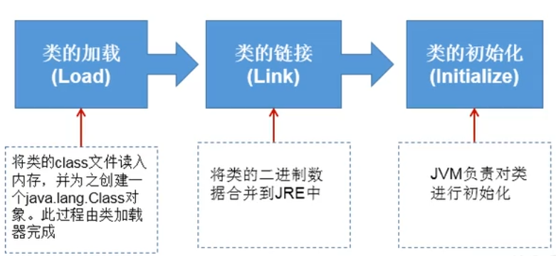
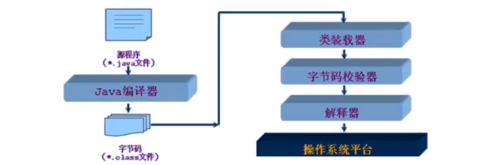
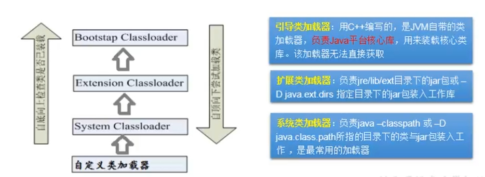

## 13. Java反射机制

1. Java反射机制概述
2. 理解Class类并获取Class实例
3. 类的加载与ClassLoader的理解
4. 创建运行时类的对象
5. 获取运行时类的完整结构
6. 调用运行时类的指定结构
7. 反射的应用：动态代理

### 1. Java反射机制概述
- Reflection(反射) 是被视为动态语言的关键，反射机制允许程序在执行期借助于 Reflection API 取得任何类的内部信息，
并能直接操作任意对象的内部属性及方法。
- 加载完类之后，在堆内存的方法区中就产生了一个Class类型的对象（一个类只有一个Class对象），这个对象就包含了完整的类
的结构信息。我们可以通过这个对象看到类的结构。**这个对象就像一面镜子，透过这个镜子看到类的结构，所以，我们形象的称之为：反射**

- 

#### 1.1 Java反射机制研究及应用

- Java反射机制提供的功能
  - 在运行时判断任意一个对象所属的类
  - 在运行时构造任意一个类的对象
  - 在运行时判断任意一个类所具有的成员变量和方法
  - 在运行时获取泛型信息
  - 在运行时调用任意一个对象的成员变量和方法
  - 在运行时处理注解
  - 生产动态代理

#### 1.2 反射相关的主要API
- `java.lang.Class`: 代表一个类, 用来描述类的类
- `java.lang.reflect.Method`: 代表类的方法
- `java.lang.reflect.Field`: 代表类的成员变量
- `java.lang.reflect.Constructor`: 代表类的构造器
- ...
 
### 补充：动态语言 和 静态语言
1. 动态语言：
    - 是一类在运行时可以改变其结构的语言：例如新的函数、对象、甚至代码可以被引进，
   已有的函数可以被删除或是其他结构上的变化。通俗点就是在运行时可以根据某些条件改变自身结构
    - 主要动态语言：Object-C, C#, JavaScript, PHP, Python, Erlang
2. 静态语言：
    - 与动态语言相对应的，运行时结构不可变的语言就是静态语言。如Java, C, C++

3. Java不是动态语言，但Java可以称之为“准动态语言”。即Java有一定的动态性，我们可以利用反射机制、字节码操作获得
类似动态语言的特性。

    Java的动态性让编程的时候更加灵活。

### 2. 理解Class类并获取Class实例

#### 2.1 疑问：
1. 反射机制与面向对象中的封装性是不是矛盾的？如何看待两个技术？
    
   答：不矛盾。 封装性是指建议如何操作，如不建议操作private属性，私有方法等。
而反射机制则表示的是能不能做，能不能调用类中的结构，而其实直接调用类的私有结构，
与调用public结构没有区别，因为public中的方法也会对私有方法进行调用等操作。

2. 通过直接new的方式或反射的方式都可以调用公共的结构，开发中到底用那个？什么时候使用反射的方式？

    答：建议用直接new的方法；如果在运行之前不能确定new那个类，则就需要使用反射的机制。
      
    **反射的特性：动态性**

#### 2.2 Class 实例对应的结构说明
##### 1. 哪些类型可以有Class对象？
1. class: 外部类，成员（成员内部类，静态内部类），局部内部类，匿名内部类
2. interface: 接口
3. [] : 数组
4. enum: 枚举
5. annotation: 注解@interface
6. primitive type: 基本数据类型
7. void
8. ```java
   Class c1 = Object.class;        // class java.lang.Object 
   Class c2 = Comparable.class;    // interface java.lang.Comparable 
   Class c3 = String[].class;      // class [Ljava.lang.String; 
   Class c4 = int[][].class;       // class [[I 
   Class c5 = ElementType.class;   // class java.lang.annotation.ElementType     
   Class c6 = Override.class;      // interface java.lang.Override 
   Class c7 = int.class;           // int 
   Class c8 = void.class;          // void 
   Class c9 = Class.class;         // class java.lang.Class 
   
   int[] a = new int[10];           
   int[] b = new int[100];          
   Class c10 = a.getClass();       // class [I     
   Class c11 = b.getClass();            
   
   // 只要元素类型与维度一样，就是同一个Class
   System.out.println(c10 == c11); // true
   ```

#### 2.3 Class对应结构代码测试
```java
    //  1. 反射之前，对于Person的操作
    @Test
    public void test01() {
        // 创建Person类的对象
        Person p1 = new Person("Tom", 21);
    
        // 通过对象，调用其内部的属性、方法
        p1.setAge(22);
        System.out.println(p1.toString());
    
        p1.show();
    
        // note: 在Person类外部，不可以通过Person类的对象调用其内部私有结构。
        // 比如：name、showNation()以及私有的构造器
    }
    
    // 2. 使用反射之后，对于Person的操作
    @Test
    public void test02() throws Exception{
        System.out.println("---------通过反射调用非私有结构------------");
        // 2.1 通过反射来创建Person类对象
        Class classPerson = Person.class;
        Constructor cons = classPerson.getConstructor(String.class, int.class);
        Object obj = cons.newInstance("Tom", 21);
        Person p = (Person) obj;
        p.setAge(22);
        System.out.println(p.toString());
    
    
        // 2.2 通过反射，调用对象指定的属性、方法
        // 调用属性getDeclaredField, 只能调用非私有化的属性和方法
        Field age = classPerson.getDeclaredField("age");
        age.set(p, 20);     // 调用Field的set()方法来设置指定属性
        System.out.println(p.toString());
    
        // 调用方法getDeclaredMethod：只能调用非私有化的方法
        Method method = classPerson.getDeclaredMethod("show");
        method.invoke(p);   // 通过调用Method的invoke()方法来调用类的方法
    
        // 2.3 通过反射，可以调用Person类的私有结构：如私有的构造器、方法和属性
        // 调用私有的构造器
        Constructor const1 = classPerson.getDeclaredConstructor(String.class);
        const1.setAccessible(true);    // 需要设置为可访问的, 否则不可访问私有结构
        Person person2 = (Person) const1.newInstance("Jack");
        System.out.println(person2);
    
        // 调用私有的属性
        Field name = classPerson.getDeclaredField("name");
        name.setAccessible(true);
        name.set(person2, "Tom");   // 通过调用set()方法来修改私有属性
        System.out.println(person2);
    
        // 调用私有的方法
        Method showNation = classPerson.getDeclaredMethod("showNation", String.class);
        showNation.setAccessible(true);
        String nation = (String) showNation.invoke(person2,"中国"); // 相当于 String nation = person.showNation("中国");
        System.out.println(nation);
    }
```

#### 2.4 Class实例化代码测试
```java
    /* 获取CLass的实例的方式 */
    public void test03() throws ClassNotFoundException {
        // 方式一：调用运行时类的属性：.class
        Class<Person> clazz1 = Person.class;
        System.out.println(clazz1); // class ReflectionTest.Person
    
        // 方式二：通过运行时类的对象
        Person p1 = new Person();
        Class clazz2 = p1.getClass();
        System.out.println(clazz2); // class ReflectionTest.Person
    
        // 方式三：调用Class的静态方法：forName(String classPath)，此时需要指明类的详细路径
        Class clazz3 = Class.forName("ReflectionTest.Person");
        System.out.println(clazz3); // class ReflectionTest.Person
        System.out.println(Class.forName("java.lang.String")); // class java.lang.String
    
        // 加载到内准中的运行时类，会缓存一定的时间。在此时间之内，我们可以通过不同的方式来获取此运行时类
        System.out.println(clazz1 == clazz2); // true
        System.out.println(clazz1 == clazz3); // true
        System.out.println(clazz2 == clazz3); // true
    
        // 方式四：使用类的加载器： ClassLoader （了解）
        ClassLoader classLoader = ReflectionTest.class.getClassLoader();
        Class clazz4 = classLoader.loadClass("ReflectionTest.Person");
        System.out.println(clazz4); // class ReflectionTest.Person
        System.out.println(clazz4 == clazz1); // true
    }
```

## 3. 类的加载与ClassLoader的理解 (Class)

#### 3.1关于java.lang.Class类的理解

Class: 通常称为反射的源头

1. 类的加载过程：程序在经过javac.exe命令以后，会生成一个或多个字节码文件（.class结尾），接着我们使用java.exe命令对某个字节码文件进行解释运行。
相当于将某个字节码文件加载到内存中，此过程就称为类的加载。
2. 加载到内存中的类，我们就称为运行时类，此运行时类就作为Class的一个实例。
3. 换句话说，Class的实例就对应这一个运行时类。
4. 加载到内准中的运行时类，会缓存一定的时间。在此时间之内，我们可以通过不同的方式来获取此运行时类

#### 3.2 类的加载过程
当程序主动使用某个类时，如果该类还未被加载到内存中，则系统会通过如下三个步骤来对该类进行初始化。

- 加载：将class文件字节码内容加载到内存中，并将这些静态数据转换为方法区的运行时数据结构，然后
生产一个代表这个类的`java.lang.Class`对象，作为方法区中类数据的访问入口（即引用地址）。所有
需要访问和使用类数据只能通过这个Class对象。这个加载的过程需要类加载器参与。

- 链接：将Java类的二进制代码合并到JVM的运行状态之中的过程。
  - 验证：确保加载的类信息符合JVM规范，例如：以cafe开头，没有安全方面的问题
  - 准备：正式为类变量（static）分配内存并**设置类变量默认初始值**的阶段，这些内存都将在方法区中进行分配
  - 解析：虚拟机常量池内的符号引用（常量名）替换为直接引用（地址）的过程

- 初始化：
  - 执行`类构造器<clinit>()`方法的过程。`类构造器<clinit>()`方法是由编译器自动收集类中的锁喉类变量的赋值动作
  和静态代码块中的语句合并产生的。（类构造器是构造类信息的，不是构造该类对象的构造器）。
  - 当初始化一个类的时候，如果发现其父类还没有进行初始化，则需要其出法其父类的初始化。
  - 虚拟机会保证一个类的\<clinit>() 方法在多线程环境中被正确加锁和同步。

    

- code test:
    ```java
    public class ClassLoadingTest {
        public static void main(String[] args) {
            System.out.println(A.m); // 100
        }
    } 
    
    class A {
        static {
            m = 300;
        }
        
        static int m = 100;
    }
    
    // 第二步：链接初始化后 m = 0;
    // 第三步：初始化后，m的值有<clinit>()方法执行决定
    //        这个A的类构造器<clinit>()方法由类变量的赋值和静态代码块中的语句按照顺序合并产生，类似于：
    //        <clinit>() {
    //            m = 300;
    //            m = 100;
    //        }
    ```


#### 3.3 类加载器的作用
- 类加载的作用：将class文件字节码内容加载到内存中，并将这些静态数据局转换成方法区的运行时数据结构，然后
在堆中生成一个代表这个类的java.lang.Class对象，作为方法区中类数据的访问入口。
- 类缓存：标准的JavaSE类加载器可以按照要求查找类，但一旦某个类被加载到类加载器中，它将维持加载（缓存）一段时间。
不过JVM垃圾回收机制可以回收这些Class对象
- 


#### 3.4 ClassLoader(了解)
类加载器作死是用来把类(class)装载进内存的。JVM规范定义了如下类型的类的加载器。


- code test:
  ```java
    @Test
    public void test01() {
        // 1. 对于自定义类，使用系统类加载器进行加载
        ClassLoader classLoader1 = ClassLoaderTest.class.getClassLoader();
        System.out.println(classLoader1); // jdk.internal.loader.ClassLoaders$AppClassLoader@2437c6dc

        // 2. 调用系统类加载的getParent() 可以扩展类加载器
        ClassLoader classLoader2 = classLoader1.getParent();
        System.out.println(classLoader2); // jdk.internal.loader.ClassLoaders$PlatformClassLoader@7e0e6aa2

        // 3. 调用扩展类加载器的getParent()：无法获取引导类加载器
        // note: 引导类加载器主要负责加载java的核心类库，无法加载自定义类的。
        ClassLoader classLoader3 = classLoader2.getParent();
        System.out.println(classLoader3);

        ClassLoader classLoader4 = String.class.getClassLoader();
        System.out.println(classLoader4); // null; 可以说明String为扩展类
    }
  
     /** Properties: 用来读取配置文件
     * 使用两种方式来读取配置文件
     */
    @Test
    public void test02() {
        // 1. 创建配置文件类
        Properties pros = null;
        FileInputStream fis = null;
        try {
            pros = new Properties();

            // 2. 读取配置文件方式一：
            // 此时FileInputStream在Test下的默认路径为当前Module下
            fis = new FileInputStream("jdbc.properties");
            pros.load(fis);

            String name = pros.getProperty("name");
            String age = pros.getProperty("age");
            System.out.println("name = " + name + ", age = " + age); // name = 孙悟空, age = 999

            // 3. 读取配置文件方式二：使用反射
            // note: 此时使用反射机制时，默认读取文件的路径为当前Module/src目录下
            ClassLoader classLoader = ClassLoaderTest.class.getClassLoader();
            InputStream resourceAsStream = classLoader.getResourceAsStream("jdbc2.properties");
            pros.load(resourceAsStream);
            name = pros.getProperty("name");
            age = pros.getProperty("age");
            System.out.println("name = " + name + ", age = " + age); // name = 猪八戒, age = 888

        } catch (IOException e) {
            e.printStackTrace();
        } finally {
            if (fis != null) {
                try {
                    fis.close();
                } catch (IOException e) {
                    e.printStackTrace();
                }
            }
        }
    }
  ```

### 4. 创建运行时类的对象
#### 4.1. 通过反射创建对应的运行时类的对象-代码测试
```java
    // newInstance() : 调用此方法，创建对应的运行时类的对象。 该方法内部调用了运行时类的空参构造器
    // 因此，如果运行时类中没有空参构造器，则会抛出异常；且不可以为private权限，如果为private则会报错
    // 要想此方法可以正常的创建运行时类的对象，要求：
    // 1. 运行时类必须提供空参的构造器；
    // 2. 空参的构造器的访问权限得够。通常设置为public
    //
    // note: 在javabean中要求提供一个public的空参构造器，原因：
    //       1. 便于通过反射，创建运行时类的对象
    //       2. 便于子类继承此运行时类，默认调用super()时，保证父类有此构造器
    @Test
    public void test01() {
        Class<Person> clazz = Person.class;
        Person person = null;
        try {
            person = clazz.getDeclaredConstructor().newInstance();
            System.out.println(person);
        } catch (InstantiationException e) {
            e.printStackTrace();
        } catch (IllegalAccessException e) {
            e.printStackTrace();
        } catch (InvocationTargetException e) {
            e.printStackTrace();
        } catch (NoSuchMethodException e) {
            e.printStackTrace();
        }
    }
```

#### 4.2 举例体会反射的动态性
```java
    // 体会反射的动态性
    @Test
    public void test02() {
        int num;
        String str = "";
        for (int i = 0; i < 10; ++i) {
            num = new Random().nextInt(3); // 生产 [0,3)以内的随机数
            switch (num) {
                case 0:
                    // 生成java.util.Date的运行时类的对象
                    str = "java.util.Date";
                    break;
                case 1:
                    // 生成java.Object的运行时类的对象
                    str = "java.lang.Object";
                    break;
                case 2:
                    // 生成Person类
                    str = "ReflectionTest.Person";
                    break;
                default:
                    break;
            }
            Object obj = null;
            try {
                obj = getInstanct(str);
            } catch (Exception e) {
                e.printStackTrace();
            }
            System.out.println(obj);
        }
    }

    // 创建一个指定类的对象。classPath: 指定类的全类名
    public Object getInstanct(String classPath) throws ClassNotFoundException, NoSuchMethodException, Exception {
        Class clazz = Class.forName(classPath);

        Object obj = clazz.getDeclaredConstructor().newInstance();
        return obj;
    }
```

### 5. 获取运行时类的完整结构
```java
    @Test
    public void test01() {
        Class clazz = Person.class;

        // 1.getMethods() : 获取当前运行时类及其所有父类中声明为public权限的方法
        Method[] method = clazz.getMethods();
        for (Method m : method) {
            System.out.println(m);
        }

        System.out.println("\n*******************");
        // 2.getDeclaredMethods(): 获取当前运行时类中声明的所有方法，包含private方法，不包含父类中的方法
        Method[] declaredMethods = clazz.getDeclaredMethods();
        for (Method m : declaredMethods) {
            System.out.println(m);
        }
    }
```

#### 5.1 获取运行时类的方法参数、注解、构造器
```java
    @Test
    /**获取方法的参数和注解
     * @xxx
     * 权限修饰符    返回值类型   方法名(参数类型1 形参名1, 参数类型2, ...) throws xxxException{}
     */
    public void test02() {
        Class clazz = Person.class;
        Method[] declaredMethods = clazz.getDeclaredMethods();
        for (Method m : declaredMethods) {
            System.out.println(m);

            // 1. 获取运行时类的方法的注解
            Annotation[] anno = m.getAnnotations();
            for (Annotation a : anno) {
                System.out.println(a);
            }

            // 2. 获取运行时类的方法的权限修饰符
            System.out.print(Modifier.toString(m.getModifiers()) + ";\t");

            // 3. 获取运行时类的方法的返回值类型
            System.out.print(m.getReturnType() + "; \t");

            // 4. 获取方法名
            System.out.print(m.getName() + "(");

            // 5. 获取形参列表
            Class[] parameterTypes = m.getParameterTypes();
            if (!(parameterTypes == null && parameterTypes.length == 0)) {
//            if (parameterTypes.length > 0) {
                for (int i = 0; i < parameterTypes.length; ++i) {
                    if (i == parameterTypes.length - 1) {
                        System.out.print(parameterTypes[i].getName() + " args_" + i);
                        break;
                    }
                    System.out.print(parameterTypes[i].getName() + " args_" + i + ", ");
                }
            }
            System.out.print(")");

            // 6. 获取抛出的异常
            Class[] exceptionTypes = m.getExceptionTypes();
            if (exceptionTypes.length > 0) {
                System.out.println(" throws ");
                for (int i = 0; i < exceptionTypes.length; ++i) {
                    if (i == exceptionTypes.length - 1) {
                        System.out.print(exceptionTypes[i].getName());
                        break;
                    }
                    System.out.print(exceptionTypes[i].getName() + ", ");
                }
            }

            System.out.println("\n");
        }
    }

    @Test
    /* 获取构造器结构 */
    public void otherTest() {
        Class clazz = Person.class;
    
        // 1. getConstructor(): 获取当前运行时类中声明为public的构造器
        Constructor[] constructor = clazz.getConstructors();
        for (Constructor con : constructor) {
            System.out.println(con);
        }
        System.out.println();

        // 2. getDeclaredConstructors() : 获取当前运行时类中声明的所有构造器
        Constructor[] declaredConstructors = clazz.getDeclaredConstructors();
        for (Constructor dec : declaredConstructors) {
            System.out.println(dec);
        }
    }

-------输出：------------
public int ReflectionTest2.Person.compareTo(java.lang.Object)
public;	int; 	compareTo(java.lang.Object args_0)

public void ReflectionTest2.Person.info()
public;	void; 	info()

public java.lang.String ReflectionTest2.Person.display(java.lang.String,int) throws java.lang.NullPointerException,java.lang.RuntimeException,java.lang.ClassCastException
public;	class java.lang.String; 	display(java.lang.String args_0, int args_1) throws
        java.lang.NullPointerException, java.lang.RuntimeException, java.lang.ClassCastException

private java.lang.String ReflectionTest2.Person.show(java.lang.String)
@ReflectionTest2.MyAnnotation(value="show")
private;	class java.lang.String; 	show(java.lang.String args_0)
```

#### 5.2 获取运行时类的属性结构，权限修饰符、类型和变量名
```java
@Test
public void test01() {
    Class clazz = Person.class;

    // 获取属性结构
    // getFields(): 获取当前运行时类及其父类中声明为public访问权限的属性
    System.out.println("*******getFields()**************");
    Field[] fields = clazz.getFields();
    for (Field f : fields) {
        System.out.println(f);
    }

    // getDeclaredFields(): 获取当前运行时类中声明的所有属性，包括private属性（不包含父类中声明的属性）
    // 获取权限修饰符  类型  变量名
    System.out.println("\n*******getDeclaredFields()**************");
    Field[] fields1 = clazz.getDeclaredFields();
    for (Field f : fields1) {
        System.out.println(f);

        // 1. 获取权限修饰符
        int modifiers = f.getModifiers();
        System.out.print("权限修饰符： " + Modifier.toString(modifiers) + "\t");

        // 2. 获取类型
        Class<?> type = f.getType();
        System.out.print("类型： " + type.getName() + "\t");

        // 3. 获取属性名
        String name = f.getName();
        System.out.print("属性名： " + name);

        System.out.println();
    }
}

@MyAnnotation(value = "Person")
public class Person extends Creature<String> implements Comparable, MyInterface{

    private String name;
    int age;
    public int id;

    public Person() {}

    @MyAnnotation(value = "Person(name)")
    private Person(String name) {
        this.name = name;
    }

    Person(String name, int age) {
        this.name = name;
        this.age = age;
    }

    @MyAnnotation(value = "show")
    private String show(String nation) {
        System.out.println("国籍： " + nation);
        return nation;
    }

    public String display(String interests, int age) throws NullPointerException, RuntimeException, ClassCastException {
        System.out.println("interest: " + interests);
        return interests + age;
    }

    @Override
    public void info() {
        System.out.println("I am a person!");
    }

    @Override
    public int compareTo(Object o) {
        return 0;
    }
}

public class Creature<T> implements Serializable {
    private char gender;
    public double weight;

    private void breath() {
        System.out.println("所有生物需要进行呼吸");
    }

    public void eat() {
        System.out.println("生物可以吃东西");
    }
}

------------输出------------
        
*******getFields()**************
public int ReflectionTest2.Person.id
public double ReflectionTest2.Creature.weight

*******getDeclaredFields()**************
private java.lang.String ReflectionTest2.Person.name
权限修饰符： private	类型： java.lang.String	属性名： name
int ReflectionTest2.Person.age
权限修饰符： 	类型： int	属性名： age
public int ReflectionTest2.Person.id
权限修饰符： public	类型： int	属性名： id
```

#### 5.3 获取运行时类的父类及其泛型
```java
@Test
    // 获取运行时 类的父类及其父类的泛型
    public void test04() {
        Class clazz = Person.class;

        // 1. getSuperclass() : 获取运行时类的父类
        Class superclass = clazz.getSuperclass();
        System.out.println(superclass); // class ReflectionTest2.Creature

        // 2. getGenericSuperclass() : 获取运行时类的带泛型的父类
        Type genericSuperclass = clazz.getGenericSuperclass();
        System.out.println(genericSuperclass); // ReflectionTest2.Creature<java.lang.String>

        // 3. 获取运行时类的带泛型的父类的泛型
        // 获取泛型结构
        ParameterizedType parameterizedType = (ParameterizedType) genericSuperclass;
        Type[] actualTypeArguments = parameterizedType.getActualTypeArguments();
        for (Type type : actualTypeArguments) {
            System.out.println(type);   // 方法一 ：class java.lang.String
            System.out.println(type.getTypeName()); // 方法二 ： java.lang.String
            System.out.println(((Class)type).getName()); // 方法三 ：java.lang.String
        }

        // 4. 获取其父类的方法
        for (Field field : superclass.getFields()) {
            System.out.println(field); // public double ReflectionTest2.Creature.weight
        }
    }
```

#### 5.4 通过反射获取运行时类的接口、所在包、注解等
```java
    /* 通过反射获取运行时类的接口、所在包、注解等 */
    public void test05() {
        Class clazz = Person.class;

        // 1. 获取运行时类的接口
        Class[] interfaces = clazz.getInterfaces();
        for (Class c : interfaces) {
            System.out.println(c);
        }

        System.out.println();
        // 获取运行时类的所在父类的接口
        Class[] interfaces1 = clazz.getSuperclass().getInterfaces();
        for (Class c : interfaces1) {
            System.out.println(c);
        }

        System.out.println();
        // 2. 获取运行时类的所在包
        Package pack = clazz.getPackage();
        System.out.println(pack);

        System.out.println();
        // 3. 获取运行时类的注解
        Annotation[] annotations = clazz.getAnnotations();
        for (Annotation anno : annotations) {
            System.out.println(anno);
        }
    }
```

### 6. 调用运行时类的指定结构

#### 6.1 获取运行时类中指定的属性
```java
// 1. 获取运行时类中指定的属性
    public void testField() throws NoSuchFieldException, IllegalAccessException, InstantiationException {
        // 1. 创建Class类
        Class clazz = Person.class;

        // 2. 创建运行时类的对象
        Person p = (Person) clazz.newInstance();
        Person p1 = (Person) clazz.newInstance();

        // 获取指定运行时类的属性，通常不采用此方法
        Field id = clazz.getField("id");

        // 3. 获取指定运行时类的属性，通常采用此方法
        // getDeclaredField(String fieldName) : 获取运行时类中指定变量名的属性
        Field age = clazz.getDeclaredField("age");

        // 设置当前属性的值
        // set(): 参数1： 指明设置那个对象的属性； 参数2：将此属性值设置为多少
        id.set(p, 1001);

        // 4. 如果想要操作非public的属性，需要使用setAccessible(true)设置为可访问的
        age.setAccessible(true);
        age.set(p1, 19);
        System.out.println(p.id);

        // 获取当前属性的值
        // get() : 参数1： 获取那个对象的当前属性值
        int pID = (int) id.get(p);
        int p1age = (int) age.get(p1);
        System.out.println(pID);
        System.out.println(p1age);
    }
```

#### 6.2 获取运行时类中指定的方法
```java
// 2. 获取运行时类中指定的方法
    @Test
    public void testMethod() throws Exception {
        Class<Person> clazz = Person.class;

        // 创建运行时类的对象
        Person p = clazz.getDeclaredConstructor().newInstance();

        // 1. 获取指定的某个方法
        Method info = clazz.getMethod("info"); // 获取public的方法

        // getDeclaredMethod(): 参数1：指明获取方法的名称; 参数2：指明获取的方法的形参列表
        Method info1 = clazz.getDeclaredMethod("show", String.class); //

        // 调用方法前需要保证是可访问的
        info1.setAccessible(true);

        // invoke(): 参数1： 方法的调用者； 参数2：给方法形参赋值的实参
        // invoke() 方法的返回值即为对应类装调用的方法的返回值。
        String str = (String) info1.invoke(p, "China");
        System.out.println(str);


        // 2. 调用静态方法
        Method showDec = clazz.getDeclaredMethod("showDesc");
        showDec.setAccessible(true);

        // 如果调用的运行时类中的方法没有返回值，则次invoke()返回null
        Object invoke = showDec.invoke(Person.class); // Person.class 可以换成null；因为前面showDec是根据Person来确定的
        System.out.println(invoke); // null
    }
```

#### 6.3 获取运行时类中指定的构造器
```java
// 3. 获取运行时类中指定的构造器
    @Test
    public void testConstructor() throws Exception{
        Class<Person> clazz = Person.class;

        // 1. 获取指定的构造器
        // getConstructor() : 参数：指明构造器的参数列表
        Constructor constructor = clazz.getDeclaredConstructor(String.class, int.class);

        // 2. 保证此构造器是可访问的
        constructor.setAccessible(true);

        // 3. 调用此构造器创建运行时类的对象
        Person p = (Person) constructor.newInstance("Tom", 21);
        System.out.println(p);
    }
```

### 7. 反射的应用：动态代理

- 代理设计模式的原理：
  - 使用一个代理将对象包装起来，然后使用该代理对象取代原始数据。任何对原始对象的调用都要通过代理。
  代理对象决定是否以及何时将方法调用转到原始对象上。
  - 之前的代理机制的操作，属于静态代理，特征是代理类和目标对象的类都是在编译期间确定下来，不利于程序的扩展。
  同时，每一个代理类只能为一个接口服务，这样一来程序开发中必然产生过多的代理。
  - 最好可以通过一个代理类完成全部代理功能。

#### 7.1 概述
 - 动态代理是指客户通过代理类来调用其它对象的方法，并且是在程序运行时根据需要动态创建目标类的代理对象。
 - 动态代理使用场合：
   - 调试
   - 远程方法调用
 - 动态代理相比于静态代理的优点：
   - 抽象角色中（接口）声明的所有方法都被转移到调用处理器一个集中的方法中处理，这样，我们可以更加灵活和统一的处理众多的方法。

#### 7.2 静态代理的代码测试：
```java
package DynamicProxyTest;

/**
 * @ClassName: StaticProxy
 * @Description: Java - 静态代理举例
 * @author: zhilx (zhilx1997@sina.com)
 * @version: v1.0
 * @data: 2022/3/30 20:22
 * @node: 静态代理举例
 *          特点：代理类和被代理类在编译期间就已经确定
 */

interface ClothFactory {
    void produceCloth();
}

// 代理类
class ProxyClothFactory implements ClothFactory {

    // 用被代理类对象进行实例化
    private ClothFactory factory;

    public ProxyClothFactory(ClothFactory factory) {
        this.factory = factory;
    }

    @Override
    public void produceCloth() {
        System.out.println("准备中...");
        factory.produceCloth();
        System.out.println("处理中...");
    }
}

// 被代理类
class NikeClothFactory implements ClothFactory {

    @Override
    public void produceCloth() {
        System.out.println("NikeFactory 生产运动服饰!");
    }
}

public class StaticProxy {
    public static void main(String[] args) {
        // 创建被代理类对象
        ClothFactory nikeClothFactory = new NikeClothFactory();

        //  创建代理类对象
        ClothFactory proxyClothFactory = new ProxyClothFactory(nikeClothFactory);

        proxyClothFactory.produceCloth();
    }
}

```