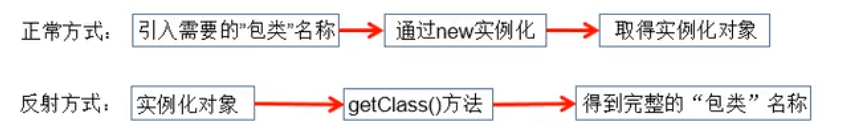

## 13. Java反射机制

1. Java反射机制概述
2. 理解Class类并获取Class实例
3. 类的加载与ClassLoader的理解
4. 创建运行时类的对象
5. 获取运行时类的完整结构
6. 调用运行时类的指定结构
7. 反射的应用：动态代理

### 1. Java反射机制概述
- Reflection(反射) 是被视为动态语言的关键，反射机制允许程序在执行期借助于 Reflection API 取得任何类的内部信息，
并能直接操作任意对象的内部属性及方法。
- 加载完类之后，在堆内存的方法区中就产生了一个Class类型的对象（一个类只有一个Class对象），这个对象就包含了完整的类
的结构信息。我们可以通过这个对象看到类的结构。**这个对象就像一面镜子，透过这个镜子看到类的结构，所以，我们形象的称之为：反射**

- 

#### 1.1 Java反射机制研究及应用

- Java反射机制提供的功能
  - 在运行时判断任意一个对象所属的类
  - 在运行时构造任意一个类的对象
  - 在运行时判断任意一个类所具有的成员变量和方法
  - 在运行时获取泛型信息
  - 在运行时调用任意一个对象的成员变量和方法
  - 在运行时处理注解
  - 生产动态代理

#### 1.2 反射相关的主要API
- `java.lang.Class`: 代表一个类, 用来描述类的类
- `java.lang.reflect.Method`: 代表类的方法
- `java.lang.reflect.Field`: 代表类的成员变量
- `java.lang.reflect.Constructor`: 代表类的构造器
- ...
 
### 补充：动态语言 和 静态语言
1. 动态语言：
    - 是一类在运行时可以改变其结构的语言：例如新的函数、对象、甚至代码可以被引进，
   已有的函数可以被删除或是其他结构上的变化。通俗点就是在运行时可以根据某些条件改变自身结构
    - 主要动态语言：Object-C, C#, JavaScript, PHP, Python, Erlang
2. 静态语言：
    - 与动态语言相对应的，运行时结构不可变的语言就是静态语言。如Java, C, C++

3. Java不是动态语言，但Java可以称之为“准动态语言”。即Java有一定的动态性，我们可以利用反射机制、字节码操作获得
类似动态语言的特性。

    Java的动态性让编程的时候更加灵活。

### 2. 理解Class类并获取Class实例

#### 2.1 疑问：
1. 反射机制与面向对象中的封装性是不是矛盾的？如何看待两个技术？
    
   答：不矛盾。 封装性是指建议如何操作，如不建议操作private属性，私有方法等。
而反射机制则表示的是能不能做，能不能调用类中的结构，而其实直接调用类的私有结构，
与调用public结构没有区别，因为public中的方法也会对私有方法进行调用等操作。

2. 通过直接new的方式或反射的方式都可以调用公共的结构，开发中到底用那个？什么时候使用反射的方式？

    答：建议用直接new的方法；如果在运行之前不能确定new那个类，则就需要使用反射的机制。
      
    **反射的特性：动态性**

#### 2.2 Class 实例对应的结构说明
##### 1. 哪些类型可以有Class对象？
1. class: 外部类，成员（成员内部类，静态内部类），局部内部类，匿名内部类
2. interface: 接口
3. [] : 数组
4. enum: 枚举
5. annotation: 注解@interface
6. primitive type: 基本数据类型
7. void
8. ```java
   Class c1 = Object.class;        // class java.lang.Object 
   Class c2 = Comparable.class;    // interface java.lang.Comparable 
   Class c3 = String[].class;      // class [Ljava.lang.String; 
   Class c4 = int[][].class;       // class [[I 
   Class c5 = ElementType.class;   // class java.lang.annotation.ElementType     
   Class c6 = Override.class;      // interface java.lang.Override 
   Class c7 = int.class;           // int 
   Class c8 = void.class;          // void 
   Class c9 = Class.class;         // class java.lang.Class 
   
   int[] a = new int[10];           
   int[] b = new int[100];          
   Class c10 = a.getClass();       // class [I     
   Class c11 = b.getClass();            
   
   // 只要元素类型与维度一样，就是同一个Class
   System.out.println(c10 == c11); // true
   ```

#### 2.3 代码测试
```java
//  1. 反射之前，对于Person的操作
@Test
public void test01() {
    // 创建Person类的对象
    Person p1 = new Person("Tom", 21);

    // 通过对象，调用其内部的属性、方法
    p1.setAge(22);
    System.out.println(p1.toString());

    p1.show();

    // note: 在Person类外部，不可以通过Person类的对象调用其内部私有结构。
    // 比如：name、showNation()以及私有的构造器
}

// 2. 使用反射之后，对于Person的操作
@Test
public void test02() throws Exception{
    System.out.println("---------通过反射调用非私有结构------------");
    // 2.1 通过反射来创建Person类对象
    Class classPerson = Person.class;
    Constructor cons = classPerson.getConstructor(String.class, int.class);
    Object obj = cons.newInstance("Tom", 21);
    Person p = (Person) obj;
    p.setAge(22);
    System.out.println(p.toString());


    // 2.2 通过反射，调用对象指定的属性、方法
    // 调用属性getDeclaredField, 只能调用非私有化的属性和方法
    Field age = classPerson.getDeclaredField("age");
    age.set(p, 20);     // 调用Field的set()方法来设置指定属性
    System.out.println(p.toString());

    // 调用方法getDeclaredMethod：只能调用非私有化的方法
    Method method = classPerson.getDeclaredMethod("show");
    method.invoke(p);   // 通过调用Method的invoke()方法来调用类的方法

    // 2.3 通过反射，可以调用Person类的私有结构：如私有的构造器、方法和属性
    // 调用私有的构造器
    Constructor const1 = classPerson.getDeclaredConstructor(String.class);
    const1.setAccessible(true);    // 需要设置为可访问的, 否则不可访问私有结构
    Person person2 = (Person) const1.newInstance("Jack");
    System.out.println(person2);

    // 调用私有的属性
    Field name = classPerson.getDeclaredField("name");
    name.setAccessible(true);
    name.set(person2, "Tom");   // 通过调用set()方法来修改私有属性
    System.out.println(person2);

    // 调用私有的方法
    Method showNation = classPerson.getDeclaredMethod("showNation", String.class);
    showNation.setAccessible(true);
    String nation = (String) showNation.invoke(person2,"中国"); // 相当于 String nation = person.showNation("中国");
    System.out.println(nation);
}
```


### 3. 类的加载与ClassLoader的理解 (Class)

#### 3.1关于java.lang.Class类的理解

Class: 通常称为反射的源头

1. 类的加载过程：程序在经过javac.exe命令以后，会生成一个或多个字节码文件（.class结尾），接着我们使用java.exe命令对某个字节码文件进行解释运行。
相当于将某个字节码文件加载到内存中，此过程就称为类的加载。
2. 加载到内存中的类，我们就称为运行时类，此运行时类就作为Class的一个实例。
3. 换句话说，Class的实例就对应这一个运行时类。
4. 加载到内准中的运行时类，会缓存一定的时间。在此时间之内，我们可以通过不同的方式来获取此运行时类

#### 3.2 代码测试
```java
/* 获取CLass的实例的方式 */
public void test03() throws ClassNotFoundException {
    // 方式一：调用运行时类的属性：.class
    Class<Person> clazz1 = Person.class;
    System.out.println(clazz1); // class ReflectionTest.Person

    // 方式二：通过运行时类的对象
    Person p1 = new Person();
    Class clazz2 = p1.getClass();
    System.out.println(clazz2); // class ReflectionTest.Person

    // 方式三：调用Class的静态方法：forName(String classPath)，此时需要指明类的详细路径
    Class clazz3 = Class.forName("ReflectionTest.Person");
    System.out.println(clazz3); // class ReflectionTest.Person
    System.out.println(Class.forName("java.lang.String")); // class java.lang.String

    // 加载到内准中的运行时类，会缓存一定的时间。在此时间之内，我们可以通过不同的方式来获取此运行时类
    System.out.println(clazz1 == clazz2); // true
    System.out.println(clazz1 == clazz3); // true
    System.out.println(clazz2 == clazz3); // true

    // 方式四：使用类的加载器： ClassLoader （了解）
    ClassLoader classLoader = ReflectionTest.class.getClassLoader();
    Class clazz4 = classLoader.loadClass("ReflectionTest.Person");
    System.out.println(clazz4); // class ReflectionTest.Person
    System.out.println(clazz4 == clazz1); // true
}
```

### 4. 创建运行时类的对象


### 5. 获取运行时类的完整结构


### 6. 调用运行时类的指定结构


### 7. 反射的应用：动态代理


