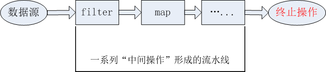

# Java8中的新特性
1. Lambda表达式
2. 函数式（Functional）接口
3. 方法引用与构造器引用
4. 强大的Stream API
5. Optional类

## 1. Java8 的新特性
- 速度更快
- 代码更少（增加了新的语法：Lambda表达式）
- 强大的Stream API
- 便于并行
  - 并行流就是把一个内容分成多个数据块，并用不同的线程分别处理每个数据块的流。
    相比于串行的流，并行的流可以很大程度上提高程序的执行效率。
  - Java 8中将并行进行了优化，我们可以很容易的对数据进行并行操作。Stream API可以声明性地
    通过parallel()与sequential()在并行流与顺序流之间进行切换。
- 最大化减少空指针异常：Optional
- Nashorn引擎，运行JVM上运行JS应用

## 2. Lambda表达式
- Lambda 是一个匿名函数，我们可以把Lambda表达式理解为时一段可以传递的代码（将代码像数据一样传递）。
使用它可以写出更简洁、更灵活的代码。作为一种更紧凑的代码风格，使Java的语言表达能力得到了提升。

- Lambda表达式：在Java8语言中引入的一种新的语法元素和操作符。这个操作符为“->”，
该操作符被称为 **Lambda 操作符**或**箭头操作符**。它将Lambda分为两个部分：
  - 左侧：指定了Lambda表达式需要的参数列表
  - 右侧：指定了Lambda体，是抽象方法的逻辑实现，也即Lambda表达式要执行的功能

### 2.1 Lambda语法：
1. 语法格式一：无参，无返回值

    `Runnable r1 = () -> {System.out.println("Hello Lambda");}`

2. 语法格式二：Lambda需要一个参数，无返回值

   `Consumer<String> con = (String str) -> {System.out.println(str);}`

3. 语法格式三：数据类型可以省略，因为可由编译器推断得出。称为“类型推断”

   `Consumer<String> con = (str) -> {System.out.println(str);}`

4. 语法格式四：Lambda若只需要一个参数时，**参数的小括号可以省略**

   `Consumer<String> con = str -> {System.out.println(str);}`

5. 语法格式五：Lambda若需要二个或以上的参数，多条执行语句，并且可以有返回值

   `Comparator<Integer> com = (x,y) -> { 
        System.out.println("实现函数式接口方法！");
        return Integer.compare(x,y);
    }`

6. 语法格式六：当Lambda体只有一条语句时，return 与大括号若有，都可以省略。

   `Comparator<Integer> com = (x,y) -> Integer.compare(x,y);`

7. 总结：

    Lambda左边：Lambda形参列表的参数类型可以省略（类型推断）；如果Lambda形参列表只有一个参数，则这一对()也可以省略。 
    
    Lambda右边：Lambda方法体应该使用一对{}包裹；如果Lambda体只有一条执行语句（可能是return语句），则可以省略这一对{}和return

### 2.2 Lambda代码测试1：
```java
package LambdaTest;

import org.junit.Test;

import java.util.Comparator;

/**
 * @ClassName: LambdaTest
 * @Description: Java - Lambda表达式举例
 * @author: zhilx (zhilx1997@sina.com)
 * @version: v1.0
 * @data: 2022/3/31 10:49
 * @node:
 */
public class LambdaTest {
    @Test
    public void test01() {
        Runnable r1 = new Runnable() {
            @Override
            public void run() {
                System.out.println("Runnable 常用方法调用");
            }
        };
        r1.run();

        System.out.println("***********************");

        Runnable r2 = () -> System.out.println("Runnable->lambda表达式调用");
        r2.run();
    }


    @Test
    public void test02() {
        // 1. 常用方法调用
        Comparator<Integer> c1 = new Comparator<Integer>() {
            @Override
            public int compare(Integer o1, Integer o2) {
                return Integer.compare(o1, o2);
            }
        };
        int compare = c1.compare(12, 21);
        System.out.println(compare);

        System.out.println("*****************************");

        // 2. 使用Lambda表达式进行调用
        Comparator<Integer> c2 = (o1, o2) -> Integer.compare(o1, o2);
        System.out.println(c2.compare(22, 11));

        // 3. 使用方法引用
        Comparator<Integer> c3 = Integer::compare;
        System.out.println(c3.compare(11, 11));
    }
}
```

### 2.3 Lambda表达式语法代码测试：
```java
    @Test
    // 语法格式一：无参，无返回值
    public void test01() {
        Runnable r1 = new Runnable() {
            @Override
            public void run() {
                System.out.println("Runnable 常用方法调用");
            }
        };
        r1.run();

        System.out.println("***********************");

        Runnable r2 = () -> System.out.println("Runnable->lambda表达式调用");
        r2.run();
    }

    @Test
    // 语法格式二：Lambda需要一个参数，无返回值
    public void test02() {
        Consumer<String> con = new Consumer<String>() {
            @Override
            public void accept(String s) {
                System.out.println(s);
            }
        };

        con.accept("小不忍则乱大谋");
        System.out.println("******************");

        // Lambda格式：
        Consumer<String> con2 = (String s) -> { System.out.println(s); };
        con2.accept("小不忍则乱大谋！");
    }

    @Test
    // 语法格式三：数据类型可以省略，因为可由编译器推断得出。称为“类型推断”
    public void test03() {
        // Lambda格式：
        Consumer<String> con1 = (String s) -> { System.out.println(s); };
        con1.accept("小不忍则乱大谋！");
        System.out.println("**************************");

        // 类型推断
        Consumer<String> con2 = (s) -> { System.out.println(s); };
        con2.accept("hhhhhhhhhh");
    }

    @Test
    // 语法格式四：Lambda若只需要一个参数时，**参数的小括号可以省略**
    public void test04() {
        Consumer<String> con1 = (String s) -> { System.out.println(s); };
        con1.accept("小不忍则乱大谋！");
        System.out.println("**************************");

        // Lambda若只需要一个参数时，参数的小括号可以省略
        Consumer<String> con2 = s -> { System.out.println(s); };
        con2.accept("hhhhhhhhhh");
    }

    @Test
    // 语法格式五：Lambda若需要二个或以上的参数，多条执行语句，并且可以有返回值
    public void test05() {
        Comparator<Integer> com1 = new Comparator<Integer>() {
            @Override
            public int compare(Integer o1, Integer o2) {
                System.out.println(o1);
                System.out.println(o2);
                return o1.compareTo(o2);
            }
        };
        System.out.println(com1.compare(11, 22));

        System.out.println("**********************");

        // Lambda表达式
        Comparator<Integer> com2 = (o1, o2) -> {
            System.out.println(o1);
            System.out.println(o2);
            return o1.compareTo(o2);
        };

        System.out.println(com2.compare(111, 22));
    }

    @Test
    // 语法格式六：当Lambda体只有一条语句时，return 与大括号若有，都可以省略。
    public void test06() {
        Comparator<Integer> com1 = (o1, o2) -> {
            System.out.println(o1);
            System.out.println(o2);
            return o1.compareTo(o2);
        };

        System.out.println(com1.compare(111, 22));
        System.out.println("*****************");

        // 当Lambda体只有一条语句时，return 与大括号若有，都可以省略。
        Comparator<Integer> com2 = (o1, o2) -> o1.compareTo(o2);
        System.out.println(com2.compare(111,222));
    }
```


## 3. 函数式（Functional）接口

### 3.1 函数式接口概念
1. 只包含一个抽象方法的接口，称为函数式接口
2. 你可以通过Lambda表达式来创建该接口的对象。（若Lambda表达式抛出一个受检异常(即：非运行时异常)，那么该异常需要在
目标接口的抽象方法上进行声明）。
3. 我们可以在一个接口上使用 `@FunctionalInterface` 注解，这样做可以检查它是否是一个函数式接口。
   同时javadoc也会包含一条声明，说明这个接口是一个函数式接口。
4. 在`java.util.function`包下定义了Java 8的丰富的函数式接口。

5. 代码测试
    ```java
       @FunctionalInterface
       public interface MyInterface {
       void method1();
       // void method2(); // error, 函数式抽象接口中只能定义一个抽象方法
       }
    ```

### 3.2 如何理解函数式接口
- Java 从诞生日起就一直倡导“一切皆对象”，在Java里面 面向对象（OOP）编程是一切。但是随着Python、
scala等语言的兴起和新技术的挑战，Java不得不做出调整以支持更加广泛的技术要求，也即java不但支持OOP
还可以支持OOF(面向函数编程)
- 在函数式编程语言中，函数被当做一等公民对待。在将函数作为一等公民的编程语言中，Lambda表达式的类型是函数。
  但是在Java8中，有所不同。在Java8中，Lambda表达式是对象，而不是函数，它们必须依附于一类特别的对象类型——函数式接口
- 简单的说，在Java8中，**Lambda表达式就是一个函数式接口的实例**。这就是Lambda表达式和函数式接口的关系。
  也就是说，只要一个对象时函数式接口的实例，那么该对象就可以用Lambda表达式来表示。
- **所有以前用匿名实现类表示的现在都可以用Lambda表达式来写。**

### 3.3 Java内置四大核心函数式接口

| 函数式接口                     | 参数类型 | 返回类型 | 用途                                                  |
|------------------------------|--------|---------|-----------------------------------------------------|
| Consumer<T> <br/>消费型接口    | T      | void    | 对类型为T的对象应用操作，包含方法，void accept(T t)                  |
| Supplier<T> <br/>供给型接口    | 无     | T       | 返回类型为T的对象，包含方法：T get()                              |
| Function<T, R><br/> 函数式接口 | T      | R       | 对类型为T的对象应用操作，并返回为R类型对象的结果。 包含方法：R apply(T t)        |
| Predicate<T> <br/> 断定型接口  | T      | boolean | 确定类型为T的对象是否满足某约束，并返回boolean值。包含方法：boolean test(T t) |

#### 1. 其他接口

| 函数式接口                                                           | 参数类型                      | 返回类型                      | 用途                                                  |
|-----------------------------------------------------------------|---------------------------|---------------------------|-----------------------------------------------------|
| BiFunction<T, U, R>                                             | T, U                      | R                         | 对类型为T, U参数应用操作，返回R类型的结果。包含方法： R apply(T t)          |
| UnaryOperator<T> <br/>Function子接口                             | T                         | T                         | 对类型为T的对象进行一元运算，并返回T类型的结果。包含方法： T apply(T t)         |
| BinaryOperator<T> <br/> (BiFunction 子接口)                      | T, T                      | R                         | 对类型为T的对象进行二元运算，并返回T类型的结果。包含方法为：T apply(T t1, T t2); |
| BiConsumer<T, U>                                                | T, U                      | void                      | 对类型为T, U参数对应操作。 包含方法为： void accept(T t, U u);       |
| BiPredicate<T, U>                                               | T, U                      | boolean                   | 包含方法为： boolean test(T t, U u);                      |
| TolnFunction<T><br/> ToLongFunction<T><br/> ToDoubleFunction<T> | T                         | int<br/> long<br/> double | 分别计算int、long、double值的函数                             |
| IntFunction<R><br/>  LongFunction<R><br/> DoubleFunction<R>     | int<br/> long<br/> double | R                         | 参考分别为int、long、double类型的函数                           |

#### 2. 代码测试
```java
package LambdaTest;

import org.junit.Test;

import java.util.ArrayList;
import java.util.Arrays;
import java.util.List;
import java.util.function.Consumer;
import java.util.function.Predicate;

/**
 * @ClassName: LambdaTest2
 * @Description: Java - Java内置的四大核心函数式接口
 * @author: zhilx
 * @version: v1.0
 * @data: 2022/4/6 20:49
 * @node:
 *          java内置的四大核心函数式接口
 *
 *          消费性接口： Consumer<T>     void accept(T t)
 *          供给型接口： Supplier<T>     T get()
 *          函数型接口： Function<T, R>  R apply()
 *          断定型接口： Predicate<T>    boolean test(T t)
 */
public class LambdaTest2 {

    @Test
    public void test1() {
        // 1. 非Lambda表达式写法
        System.out.println("***************非Lambda表达式写法****************");
        happyTime(500, new Consumer<Double>() {

            @Override
            public void accept(Double aDouble) {
                System.out.println("消费 " + aDouble + " 元来提示学习能力");
            }
        });

        // 2. Lambda表达式写法
        System.out.println("***************Lambda表达式写法****************");
        happyTime(500, (money) -> System.out.println("消费 " + money + " 元来提示学习能力"));
    }

    public void happyTime(double money, Consumer<Double> con) {
        con.accept(money);
    }

    @Test
    public void test2() {
        List<String> list = Arrays.asList("北京", "南京", "天津", "重庆", "成都", "东京");

        // 1. 非Lambda表达式写法，输出包含“京”的字符串
        System.out.println("***************非Lambda表达式写法****************");
        List<String> filterStrs = filterString(list, new Predicate<String>() {
            @Override
            public boolean test(String s) {
                if (s.contains("京")) return true;

                return false;
            }
        });
        System.out.println(filterStrs);


        // 2. Lambda表达式写法，输出包含“京”的字符串
        System.out.println("*************** Lambda表达式写法****************");
        List<String> filterStrs2 = filterString(list, (String str) -> {return str.contains("京");});
        System.out.println(filterStrs2);

    }

    // 根据给定的规则，过滤集合中的字符串。此规则由Predicate方法决定
    public List<String> filterString(List<String> list, Predicate<String> pre) {
        ArrayList<String> filterList = new ArrayList<>();

        for (String s : list) {
            if (pre.test(s)) {
                filterList.add(s);
            }
        }

        return filterList;
    }
}

```

## 4. 方法引用与构造器引用

### 4.1 方法引用
- 当要传递给Lambda体的操作，已经有实现的方法了 ，可以使用方法引用！
- 方法引用可以看做是Lambda表达式深层次的表达。换句话说，方法引用就是Lambda表达式，也就是函数式接口的一个实例，
通过方法的名字来指向一个方法，可以认为是Lambda表达式的一个语法糖。
- 要求：实现接口的抽象方法的参数列表和返回值类型，必须与方法引用的方法的参数列表和返回值类型保持一致！
- 格式：使用操作符 “::” 将类（或对象）与方法名分隔开来。
- 如下三种主要使用情况：
  - 对象::实例方法名
  - 类::静态方法名
  - 类：实例方法名

- 方法引用，本质上就是Lambda表达式，而Lambda表达式作为函数式接口的实例。所以方法引用，也就是函数式接口的实例。

#### 方法引用的代码测试1
Employee的具体代码可见我的gitee仓库：[Employee和测试代码仓库](https://gitee.com/zhixin199/advanced-part-of-2-java/tree/master/9-Java8的其它新特性/src/MethodReferenceTest)
```java
// note: Employee包含：id, String name, int age, double salary变量
//       以及包含四个变量的get,set方法，toString,equal(),hashCode()等方法


/** 1. 情况一：对象::实例方法名 */
// Consumer中的void accept(T t)
// PrintStream中的void println(T t)
public void test01() {
    // 1. 非Lambda表达式
    Consumer<String> con1 = new Consumer<String>() {
        @Override
        public void accept(String s) {
            System.out.println(s);
        }
    };
    con1.accept("北京1");

    // 2. Lambda表达式
    Consumer<String> con2 = s -> System.out.println(s);
    con2.accept("北京2");

    // 3. 方法引用
    PrintStream ps = System.out;
    Consumer<String > con3 = ps::println;
    con3.accept("beijing");
}

// Supplier中的 T get();
// Employee中的 String getName()
@Test
public void test2() {
    Employee employee = new Employee(001, "jack", 34, 2200.123);

    // 1. 不使用Lambda表达式
    Supplier<String> supplier1 = new Supplier<String>() {
    @Override
    public String get() {
            return employee.getName();
        }
    };
    System.out.println(supplier1.get()); // jack

    // 2. Lambda表达式方法
    Supplier<String> supplier2 = () -> employee.getName();
    System.out.println(supplier2.get()); // jack

    // 3. 方法引用
    Supplier<String> supplier3 = employee::getName;
    System.out.println(supplier3.get()); // jack
}

/** 2. 情况情况二：类::静态方法 */
// Comparator中int compare(T t1, T t2)
// Integer 中int compare(T t1, T t2)
@Test
public void test03() {
    // 1. 非Lambda表达式
    Comparator<Integer> comparator1 = new Comparator<>() {
    @Override
    public int compare(Integer o1, Integer o2) {
            return Integer.compare(o1, o2);
        }
    };
    System.out.println(comparator1.compare(10, 11)); // -1

    // 2. Lambda表达式1
    Comparator<Integer> comparator2 = (o1, o2) -> {
        return Integer.compare(o1, o2);
    };
    System.out.println(comparator1.compare(11, 11)); // 0

    // 3. Lambda表达式2
    Comparator<Integer> comparator3 = (o1, o2) -> Integer.compare(o1, o2);
    System.out.println(comparator1.compare(12, 11)); // 1

    // 4. 方法引用
    Comparator<Integer> comparator4 = Integer::compare;
        System.out.println(comparator4.compare(12, 11)); // 1
    }

// Function中的R apply(T t)
// Math中的Long round(Double d);
@Test
public void test04() {
    // 1. 非Lambda表达式
    Function<Double, Long> function1 = new Function<Double, Long>() {
    @Override
    public Long apply(Double d) {
            return Math.round(d);
        }
    };
    System.out.println(function1.apply(123.321)); // 123

    // 2. Lambda表达式
    Function<Double, Long> function2 = d -> Math.round(d);
    System.out.println(function1.apply(321.123)); // 321

    // 3. 方法引用
    Function<Double, Long> function3 = Math::round;
    System.out.println(function3.apply(231.132)); // 231
}

/** 情况三：类::实例方法 (有难度) */
// Comparator中int compare(T t1, T t2)
// String 中的 int t1.compareTo(t2)
@Test
public void test05() {
    // 1. 非Lambda表达式
    Comparator<String> comparator1 = new Comparator<String>() {
    @Override
    public int compare(String o1, String o2) {
        return o1.compareTo(o2);
        }
    };
    System.out.println(comparator1.compare("a", "e")); // a - e =  -4

    // 2. Lambda表达式
    Comparator<String> comparator2 = (o1, o2) -> o1.compareTo(o2);
    System.out.println(comparator1.compare("cde", "zbd")); // cde - abd = c - z = -23

    // 3. 方法引用
    Comparator<String> comparator3 = String::compareTo;
    System.out.println(comparator1.compare("22", "22")); // 0
}

// BiPredicate中boolean test(T t1, T t2);
// String 中的boolean t1.equals(t2)
@Test
public void test06() {
    // 1. Lambda表达式
    BiPredicate<String, String> biPredicate1 = (s1, s2) -> s1.equals(s2);
    System.out.println(biPredicate1.test("abc", "abc")); // true

    // 2. 方法引用
    BiPredicate<String, String> biPredicate2 = String::equals;
    System.out.println(biPredicate2.test("abc", "abd")); // false
    System.out.println(biPredicate2.test("abc", "abc")); // true
}

// Functions的 R apply(T t)
// Employee中的String getName();
@Test
public void test07() {
    Employee employee = new Employee(1002, "Merry", 24, 8000);

    // 1. 使用Lambda
    Function<Employee, String> function1 = e -> e.getName();
    System.out.println(function1.apply(employee)); // Merry

    // 2. 使用方法引用
    Function<Employee, String> function2 = Employee::getName;
    System.out.println(function2.apply(employee)); // Merry
}
```

### 4.2 构造器引用和数组引用
1. 构造器引用：
   和方法引用类似，函数式接口的抽象方法的形参列表要和构造器的形参列表一致。
   抽象方法的返回值类型即为构造器所属的类的类型
2. 数组引用
   如果把数组看做是一个特殊的类，则写法与构造器引用一致。
```java
package MethodReferenceTest;

import org.junit.Test;

import java.util.Arrays;
import java.util.function.BiFunction;
import java.util.function.Function;
import java.util.function.Supplier;

/**
 * @ClassName: ConstructorRefTest
 * @Description: Java
 * @author: zhilx (zhilx1997@sina.com)
 * @version: v1.0
 * @data: 2022/4/11 11:37
 * @node: 构造器引用和数组引用
 *
 *        1. 构造器引用：
 *           和方法引用类似，函数式接口的抽象方法的形参列表要和构造器的形参列表一致。
 *           抽象方法的返回值类型即为构造器所属的类的类型
 *
 *        2. 数组引用
 *           如果把数组看做是一个特殊的类，则写法与构造器引用一致。
 */
public class ConstructorRefTest {
    // 构造器引用
    // Supplier中的T get()
    // Employee的空参构造器 Employee()
    @Test
    public void test01() {
        // 1. 原始方法
        Supplier<Employee> supplier1 = new Supplier<Employee>() {
            @Override
            public Employee get() {
                return new Employee();
            }
        };
        System.out.println(supplier1.get());
        System.out.println("**************************");

        // 2. Lambda表达式
        // Supplier<Employee> supplier2 = () -> new Employee(1001, "jack", 23, 1231.123); // 这个也可以实现
        Supplier<Employee> supplier2 = () -> new Employee();
        System.out.println(supplier2.get()); 
        // 相当于 44,45行：Employee employee = supplier3.get(); System.out.println(employee);
        System.out.println("**************************");

        // 3. 构造器引用
        Supplier<Employee> supplier3 = Employee::new;
        Employee employee = supplier3.get();
        System.out.println(employee);
    }

    // Function中的R apply(T t)
    @Test
    public void test02() {

        // 1. Lambda表达式格式
        Function<Integer, Employee> function1 = (id) -> new Employee(id);
        Employee employee = function1.apply(1001);
        System.out.println(employee.getId());

        // 2. 方法调用
        Function<Integer, Employee> function2 = Employee::new;
        Employee employee2 = function2.apply(1002);
        System.out.println(employee2.getId());

    }

    // BiFunction中的 R apply(T t, U u)
    @Test
    public void test03() {
        // 1. 普通方法
        System.out.println("普通方法调用抽象接口来实现Employee类的初始化");
        BiFunction<Integer, String, Employee> biFunction = new BiFunction<Integer, String, Employee>() {
            @Override
            public Employee apply(Integer id, String name) {
                return new Employee(id, name);
            }
        };
        Employee employee1 = biFunction.apply(89, "王五");
        System.out.println(employee1);
        System.out.println();

        // 2. Lambda表达式
        System.out.println("Lambda方法调用抽象接口来实现Employee类的初始化");
        BiFunction<Integer, String, Employee> biFunction2 = (id, name) -> new Employee(id, name);
        Employee employee2 = biFunction2.apply(12, "李四");
        System.out.println();

        // 3. 构造器方法调用
        System.out.println("构造器方法：Lambda方法调用抽象接口来实现Employee类的初始化");
        BiFunction<Integer, String, Employee> biFunction3 = Employee::new;
        Employee employee3 = biFunction3.apply(11, "吉姆");
        System.out.println(employee3);
    }

    // 数组引用
    // Function中的 R apply(T t)
    @Test
    public void test04() {
        // 1. Lambda表达式引用
        Function<Integer, String[]> function1 = (length) -> new String[length];
        String[] str1 = function1.apply(10);
        System.out.println(Arrays.toString(str1));
        System.out.println("********************");

        // 2. 数组引用
        Function<Integer, String[]> function2 = String[]::new;
        String[] str2 = function2.apply(5);
        System.out.println(Arrays.toString(str2));
    }
}

```


## 5. 强大的Stream API

- Java8 中有两个最为重要的改变。第一个是Lambda表达式；另外一个则是Stream API


- Stream API (java.util.stream) 把真正的函数式编程风格引入到Java中。这是目前
为止对Java类库最好的补充，因为Stream API可以极大提供Java程序员的生产力，让程序员写出高效、干净、简洁的代码


- Stream 是Java8 中处理集合的关键抽象概念，它可以指定你希望对集合进行的操作，可以执行非常复杂的查找、
过滤和映射数据等操作。使用Stream API来并行执行操作，就类似于使用API使用SQL执行的数据库查询。
也可以使用Stream API来并行执行操作。简言之，Stream API提供了一种高效且易于使用的处理数据的方式。

1. 为什么要使用Stream API ?
   - 实际开发中，项目中多数数据源都来自Mysql、Qracle等。但现在数据源可以更多了，有MongDB, Radis等，而这些
   NoSQL的数据就需要Java层面去处理。

   - Stream和Collection集合的区别：Collection是一种静态的内存数据结构，而Stream是有关计算的。
   前者是主要面向内存，存储在内存中，后者主要是面向CPU，通过CPU实现计算。


2. 什么是Stream
   - Stream 就是数据渠道，用于操作数据源（集合、数组等）所生成的元素序列。
   
   - “集合讲的是数据，Stream讲的是计算”

3. 注意：
   - Stream自己不会存储元素。
   - Stream不会改变源对象。相反，他们会返回一个持有结果的新的Stream
   - Stream操作时延迟执行的。这意味着他们会等到需要结果的时候才执行。

### 5.1 Stream 操作的三个步骤

1. 创建Stream：一个数据源（如：集合、数组），获取一个流
2. 中间操作：一个中间操作链，对数据源的数据进行处理
3. 终止操作（终端操作）：一旦执行终止操作，就执行中间操作链，并产生结果。之后不会再被使用。



### 5.2 创建Stream的四种方式
#### 1. 创建Stream方式一：通过集合

Java8 中的 Collection 接口被扩展，提供了两个获取流的方法：
- `default Stream<E> stream()` : 返回一个顺序流
- `defalut Stream<E> parallelStream()` : 返回一个并行流
- 代码测试：
  ```java
    // 创建Stream方式一：通过集合
    @Test
    public void test01(){
        List<Employee> employees = EmployeeData.getEmployees();

        // default Stream<E> stream() : 返回一个顺序流
        Stream<Employee> stream = employees.stream();
        Object[] employeeps = stream.toArray(); // 将stream流转换为Object数组

        long t1 = System.currentTimeMillis();
        for (Object o : employeeps) {
            System.out.println(o);
        }
        long t2 = System.currentTimeMillis();
        System.out.println(t2 - t1); // 17 ms
        System.out.println("**************************\n");

        // default Stream<E> parallelStream() : 返回一个并行流
        Stream<Employee> employeeStream = employees.parallelStream();
        Object[] objects = employeeStream.toArray();
        t1 = System.currentTimeMillis();
        for (Object o : objects) {
            System.out.println(o);
        }
        System.out.println(System.currentTimeMillis() - t1); // 0 ms
    }
  ```

#### 2. 创建Stream方式二：通过数组

Java8中的Arrays的静态方法 stream() 可以获取数组流

- `static <T> Stream<T> stream(T[] array)` : 返回一个流

重载形式，能够处理对应基本类型的数组：
- `public static IntStream stream(int[] array)`
- `public static LongStream stream(long[] array)`
- `public static DoubleStream stream(double[] array)`
- 代码测试：
  ```java
    // 创建Stream方式二：通过数组
    @Test
    public void test02() {
        // 调用Arrays类的 static <T> stream<T> stream(int[] array)：返回一个流

        int[] arr = new int[] {1,2,3,4,5,6};
        IntStream stream = Arrays.stream(arr);
        System.out.println(stream.sum()); // 21

        Employee e1 = new Employee(1, "jack");
        Employee e2 = new Employee(2, "lisi");
        Employee[] arr2 = new Employee[]{e1, e2};
        Stream<Employee> stream2 = Arrays.stream(arr2);
        System.out.println(stream2.toString());
    }
  ```

#### 3. 创建Stream方式三：通过Stream的of()
- 可以调用Stream类静态方法of()， 通过显式值创建一个流。它可以接收任意数量的参数。
- `public static<T> Stream<T> of(T... values)` : 返回一个流
- 代码测试：
  ```java
    // 创建Stream方式三：通过Stream的of()
    @Test
    public void test03() {
        Stream<Integer> integerStream = Stream.of(1, 2, 3, 4, 5, 6);
    }
  ```

#### 4. 创建Stream方式四：创建无限流
可以使用静态方法 Stream.iterate() 和 Stream.generate()创建无限流
- 迭代：`public static<T> Stream<T> iterate(final T seed, final UnaryOperator<T> f)`
- 生成：`public static<T> Stream<T> generate(Supplier<T> s)`
- 代码测试：
  ```java
    // 创建Stream方式四：创建无限流
    public void test04() {
        // 1. 迭代Stream.iterate()，遍历前10个偶数
        Stream.iterate(0, t -> t + 2).limit(10).forEach(System.out::println);

        // 2. 使用生产函数来产生10个随机数
        Stream.generate(Math::random).limit(10).forEach(System.out::println);
    }
  ```


### 5.3 Stream的中间操作

多个中间操作可以连接起来形成一个流水线，除非流水线上触发终止操作，否则中间操作不会执行任何的处理！
而在终止操作时一次性全部处理，称为“惰性求值”。

#### 1. 筛选与切片
| 方法                 | 描述                                                |
|---------------------|---------------------------------------------------|
| filter(Predicate p) | 接口Lambda，从流中排出某些元素                                |
| distinct()          | 筛选，通过流所生成元素的hashCode()和equals()去除重复元素             |
| limit(long maxSize) | 截断流，使其元素不超过给定数量                                   |
| skip(long n)        | 跳过元素，返回一个扔掉了前n个元素的流。若流中元素不足n个，则返回一个空流。与limit(n)互补 |

- 代码测试：
```java
package StreamAPITest;

import MethodReferenceTest.Employee;
import MethodReferenceTest.EmployeeData;
import org.junit.Test;

import java.util.List;
import java.util.stream.Stream;

/**
* @ClassName: StreamAPITest2
* @Description: Java - Stream API的中间操作
* @author: zhilx
* @version: v1.0
* @data: 2022/4/12 9:15
* @node: 测试Stream的中间操作：
*
*/
public class StreamAPITest2 {

    // 1. 筛选与切片
    @Test
    public void test01() {
        List<Employee> list = EmployeeData.getEmployees();
        System.out.println("list中元素的数量：" + list.size());
        /**
         * note：对流进行终止操作后，该流就被关闭，相等于Iterator的调用，关闭后必须创新创建或打开才可以继续使用。
         */

        // filter(Predicate p) : 接口Lambda，从流中排出某些元素
        // 练习：查询员工表中年龄小于45的员工信息
        System.out.println("-----打印表中年龄大于45的CEO的数量-----");
        Stream<Employee> stream = list.stream();
        stream.filter(e -> e.getAge() > 45).forEach(System.out::println);

        // note: forEach()表示Stream的终止操作，当调用该条件时已经将Stream关闭，因此后面的流无法指向相应的操作
        //       如果想要执行，则必须重新创建Stream流
        System.out.println("\n-----截断表中的前5个元素-----");
        // limit(long maxSize) : 截断流，使其元素不超过给定数量
        list.stream().limit(5).forEach(System.out::println);

        System.out.println("\n-----跳过表中的前5个元素，打印剩下的元素-----");
        // skip(long n)        : 跳过元素，返回一个扔掉了前n个元素的流。若流中元素不足n个，则返回一个空流。与limit(n)互补
        list.stream().skip(5).forEach(System.out::println);

        System.out.println("\n-----使用distince()去除表中重复的元素-----");
        // distinct()          : 筛选，通过流所生成元素的hashCode()和equals()去除重复元素
        list.add(new Employee(1010, "jack", 44, 8000.00));
        list.add(new Employee(1010, "jack", 45, 8000.00)); // age为45，所以该元素和其余的4个元素的的hashCode不相同，因此会重复打印
        list.add(new Employee(1010, "jack", 44, 8000.00));
        list.add(new Employee(1010, "jack", 44, 8000.00));
        list.add(new Employee(1010, "jack", 44, 8000.00));
        list.stream().distinct().forEach(System.out::println);
    }
}

/**-----输出：-------
 
 list中元素的数量：9
 -----打印表中年龄大于45的CEO的数量-----
 Employee{id=1002, name='马云', age=54, salary=2318293.0}
 Employee{id=1003, name='雷军', age=52, salary=1.2543234E7}
 Employee{id=1004, name='刘强东', age=48, salary=1.2312341E7}
 Employee{id=1007, name='比尔盖茨', age=58, salary=8.41909312E8}

 -----截断表中的前5个元素-----
 Employee{id=1001, name='马化腾', age=44, salary=4.0E8}
 Employee{id=1002, name='马云', age=54, salary=2318293.0}
 Employee{id=1003, name='雷军', age=52, salary=1.2543234E7}
 Employee{id=1004, name='刘强东', age=48, salary=1.2312341E7}
 Employee{id=1005, name='李彦宏', age=43, salary=9.0128123331E8}

 -----跳过表中的前5个元素，打印剩下的元素-----
 Employee{id=1006, name='扎克伯格', age=40, salary=9.9899123123E7}
 Employee{id=1007, name='比尔盖茨', age=58, salary=8.41909312E8}
 Employee{id=1008, name='马斯克', age=45, salary=8907813.0}
 Employee{id=1009, name='李想', age=34, salary=1231234.0}

 -----使用distince()去除表中重复的元素-----
 [Ljava.lang.Object;@4f51b3e0
 Employee{id=1001, name='马化腾', age=44, salary=4.0E8}
 Employee{id=1002, name='马云', age=54, salary=2318293.0}
 Employee{id=1003, name='雷军', age=52, salary=1.2543234E7}
 Employee{id=1004, name='刘强东', age=48, salary=1.2312341E7}
 Employee{id=1005, name='李彦宏', age=43, salary=9.0128123331E8}
 Employee{id=1006, name='扎克伯格', age=40, salary=9.9899123123E7}
 Employee{id=1007, name='比尔盖茨', age=58, salary=8.41909312E8}
 Employee{id=1008, name='马斯克', age=45, salary=8907813.0}
 Employee{id=1009, name='李想', age=34, salary=1231234.0}
 Employee{id=1010, name='jack', age=44, salary=8000.0}
 Employee{id=1010, name='jack', age=45, salary=8000.0}

 Process finished with exit code 0

/
```

#### 2. 映射
| 方法                             | 描述                                         |
|---------------------------------|--------------------------------------------|
| map(Function f)                 | 接收一个函数作为参数，该函数会被应用到每个元素上，并将其映射成一个新的函数      |
| mapToDouble(ToDoubleFunction f) | 接收一个函数作为参数，该函数会被应用到每个元素上，产生一个新的DoubleStream |
| mapToInt(ToIntFunction f)       | 接收一个函数作为参数，该函数会被应所有到每个元素上，产生一个新的IntStream  |
| mapToLong(ToLongFunction f)     | 接收一个函数作为参数，该函数会被应所有到每个元素上，产生一个新的LongStream |
| flatMap(Function f)             | 接收一个函数作为参数，将流中的每个值都换成另一个流，然后把所有流都连接成一个流    |

- 代码测试
```java
    /**
     * 2. 映射
     * | 方法                             | 描述                                         |
     * |---------------------------------|--------------------------------------------|
     * | map(Function f)                 | 接收一个函数作为参数，该函数会被应用到每个元素上，并将其映射成一个新的函数，相当于list.add()|
     * | mapToDouble(ToDoubleFunction f) | 接收一个函数作为参数，该函数会被应用到每个元素上，产生一个新的DoubleStream |
     * | mapToInt(ToIntFunction f)       | 接收一个函数作为参数，该函数会被应所有到每个元素上，产生一个新的IntStream  |
     * | mapToLong(ToLongFunction f)     | 接收一个函数作为参数，该函数会被应所有到每个元素上，产生一个新的LongStream |
     * | flatMap(Function f)             | 接收一个函数作为参数，将流中的每个值都换成另一个流，然后把所有流都连接成一个流，相当于list.addAll()|
     */
    @Test
    public void test02() {
        // map(Function f) : 接收一个函数作为参数，该函数会被应用到每个元素上，并将其映射成一个新的函数。相当于list.add()
        List<String> list = Arrays.asList("aa", "bb", "cc", "dd");
        // 将list中的所有元素转换为大写
        list.stream().map(str -> str.toUpperCase(Locale.ROOT)).forEach(System.out::println);
        System.out.println();

        // 练习1：获取员工姓名长度大于3的员工的姓名
        System.out.println("----- 获取员工姓名长度大于3的员工的姓名 -----");
        List<Employee> employees = EmployeeData.getEmployees();
        // e -> getName() 可以写成: Employee::getName
        // employees.stream().map(e -> e.getName()).filter(name -> name.length() > 3).forEach(System.out::print ln);
        employees.stream().map(Employee::getName).filter(name -> name.length() > 3).forEach(System.out::println);

        // 练习2：使用自定义的函数
        System.out.println("----- 使用自定义函数 -----");
        Stream<Stream<Character>> arrayListStream = list.stream().map(StreamAPITest2::fromStringToStream);
        arrayListStream.forEach(s -> {
            s.forEach(System.out::println);
        });;

        // flatMap(Function f) : 接收一个函数作为参数，将流中的每个值都换成另一个流，然后把所有流都连接成一个流。相当于list.addAll()
        System.out.println("-----------");
        Stream<Character> stream = list.stream().flatMap(StreamAPITest2::fromStringToStream);
        stream.forEach(System.out::println);

    }

    // 将字符串中的多个字符构成的集合转换为对应的Stream实例
    public static Stream<Character> fromStringToStream(String str) {
        ArrayList<Character> list = new ArrayList<>();
        for (Character c : str.toCharArray()) {
            list.add(c);
        }

        return list.stream();
    }

/** 输出
 AA
 BB
 CC
 DD

 ----- 获取员工姓名长度大于3的员工的姓名 -----
 扎克伯格
 比尔盖茨
 ----- 使用自定义函数 -----
 a
 a
 b
 b
 c
 c
 d
 d
 -----------
 a
 a
 b
 b
 c
 c
 d
 d
 */
```

#### 3. 排序
| 方法                    | 描述                |
|------------------------|-------------------|
| sorted                 | 产生一个新流，其中按自然顺序排序  |
| sorted(Comparator com) | 产生一个新流，其中按比较器顺序排序 |

- 代码测试：
```java
public void test03() {
    // 1. sorted() - 自然排序
    List<Integer> integers = Arrays.asList(10, 3, 90, -10, 38, 74, 26, 29);
    integers.stream().sorted().forEach(System.out::println); // -10, 3, 10, 26, 29, 38, 74, 90

    // 2. sorted(Comparator com) - 定制排序
    // 如果想要对自定义数据排序，则需要在自定义数据中实现Comparable接口 或者使用 Comparator接口
    List<Employee> employees = EmployeeData.getEmployees();
    employees.stream().sorted((e1, e2) -> {
    // 首先按照年龄从大到小排序，如果年龄相同则按照薪资从小到大排序
    int age = -Integer.compare(e1.getAge(), e2.getAge());
    if (age != 0) {
        return age;
    } else {
        return Double.compare(e1.getSalary(), e2.getSalary());
    }

    }).forEach(System.out::println);
} 
```


### 5.4 Stream的终止操作
- 终端操作会从流的流水线生成结果。其结果可以是任何不是流的值，例如：List、Integer，甚至是void。
- 流进行了终止操作后，不能再次使用

#### 1. 匹配与查找
| 方法                     | 描述                                                                  |
|------------------------|---------------------------------------------------------------------|
| allMatch(Predicate p)  | 检查是否匹配所有元素                                                          |
| anyMatch(Predicate p)  | 检查是否至少匹配一个元素                                                        |
| noneMatch(Predicate p) | 检查是否没有匹配所有元素                                                        |
| findFirst()            | 返回第一个元素                                                             |
| findAny()              | 返回当前流中的任意元素                                                         |
| count()                | 返回流中的元素总数                                                           |
| max(Comparator c)      | 返回流中的最大值                                                            |
| min(Comparator c)      | 返回流中的最小值                                                            |
| forEach(Consmuer c)    | 内部迭代(使用Collection 接口需要用户去做迭代，称为外部迭代。相反，Stream API使用内部迭代器——他帮你把迭代做了) |

```java
/** 1. 匹配与查找   */
    @Test
    public void test01() {
        List<Employee> employees = EmployeeData.getEmployees();

        // 1. allMatch(Predicate p) : 检查是否匹配所有元素
        // 练习：判断是否所有员工的年龄都大于18
        System.out.println("----- 判断所有员工的年龄身边大于18 -----");
        System.out.println(employees.stream().allMatch(e -> e.getAge() > 18)); // true

        // 2. anyMatch(Predicate p) : 检查是否至少匹配一个元素
        System.out.println("----- 判断是否存在员工的工作大于12k -----");
        System.out.println(employees.stream().anyMatch(e -> e.getSalary() > 12000)); // false

        // 3. noneMatch(Predicate p) : 检查是否没有匹配所有元素
        System.out.println("----- 判断是否存在员工姓“雷” -----");
        System.out.println(employees.stream().noneMatch(e -> e.getName().contains("雷"))); // false
        System.out.println("----- 判断是否存在员工姓“任” -----");
        System.out.println(employees.stream().noneMatch(e -> e.getName().contains("任"))); // true

        // 4. findFirst() : 返回第一个元素
        System.out.println("----- 返回第一个元素 -----");
        // 输出： Optional[Employee{id=1001, name='马化腾', age=44, salary=4.0E8}]
        System.out.println(employees.stream().findFirst());
        // Optional[Employee{id=1007, name='比尔盖茨', age=58, salary=11112.0}]
        System.out.println(employees.stream().sorted((e1, e2) -> Integer.compare(e1.getAge(), e2.getAge())).findAny());

        // 5. findAny() : 返回当前流中的任意元素
        System.out.println("----- 返回当前流中的任意元素 -----");
        // Optional[Employee{id=1006, name='扎克伯格', age=40, salary=9983.123}]
        System.out.println(employees.parallelStream().findAny());
        // Optional[Employee{id=1004, name='刘强东', age=48, salary=4521.0}]
        System.out.println(employees.parallelStream().sorted((e1, e2) -> Integer.compare(e1.getAge(), e2.getAge())).findAny());
    }

    @Test
    public void test02() {
        List<Employee> employees = EmployeeData.getEmployees();

        // 6.count() - 方案当前流中的总个数
        System.out.println("----- 返回当前流中的工资大于8000的个数 -----");
        System.out.println(employees.stream().filter(e -> e.getSalary() > 8000).count()); // 6

        // 7. max(Comparator c) ：返回流中的最大值
        System.out.println("---- 返回最高的工资的员工 -----");
        // Optional[Employee{id=1007, name='比尔盖茨', age=58, salary=11112.0}]
        System.out.println(employees.stream().max((e1, e2) -> Double.compare(e1.getSalary(), e2.getSalary())));

        // 8. min(Comparator c) : 返回流中的最小值
        System.out.println("----- 返回最低工资的员工 -----");
        // Optional[Employee{id=1009, name='李想', age=34, salary=1234.0}]
        System.out.println(employees.stream().max((e1, e2) -> -Double.compare(e1.getSalary(), e2.getSalary())));
        System.out.println(employees.stream().map(e -> e.getSalary()).max(Double::compare)); // Optional[11112.0]

        // 9. forEach(Consumer c) : 内部迭代
        System.out.println("----- forEach进行内部迭代 -----");
        employees.stream().forEach(System.out::println);
    }
```

#### 2. 规约
| 方法                              | 概述                                |
|----------------------------------|-----------------------------------|
| reduce(T iden, BinaryOperator b) | 可以将流中元素反复结合起来，得到一个值。返回T           |
| reduce(BinaryOperator b)         | 可以将流中元素反复结合起来，得到一个值。返回Optional<T> |

备注： map和reduce的连接通常称为map-reduce模式，因Google用它来进行网络搜索而出名。

```java
 @Test
public void test03() {
    // 1. reduce(T iden, BinaryOperator b) : 可以将流中元素反复结合起来，得到一个值。返回T
    // iden表示一个初始值，这里设置为0
    System.out.println("----- 练习：计算1-10的自然数的和-----");
    List<Integer> integers = Arrays.asList(1, 2, 3, 4, 5, 6, 7, 8, 9, 10);
    System.out.println(integers.stream().reduce(0, (i1, i2) -> i1 + i2)); // 55
    System.out.println(integers.stream().reduce(0, Integer::sum)); // 55

    // 2. reduce(BinaryOperator b): 可以将流中元素反复结合起来，得到一个值。返回Optional<T>
    System.out.println("-----计算公司所有员工的工资的总和 -----");
    List<Employee> employees = EmployeeData.getEmployees();
    // employees.stream().reduce((e1, e2) -> e1.getSalary() + e2.getSalary()); // 需要使用map进行映射，取出其中的salary
    Optional<Double> reduce = employees.stream().map(Employee::getSalary).reduce(Double::sum); // 和下面语句的作用一样
    reduce = employees.stream().map(e -> e.getSalary()).reduce((d1, d2) -> d1 + d2); // Optional[71761.246]
    System.out.println(reduce); // Optional[71761.246]

    System.out.println("----- 练习：使用reduce(BinaryOperator p)计算1-10的自然数的和-----");
    System.out.println(integers.stream().reduce( Integer::sum)); // Optional[55]
}
```

#### 3. 收集
| 方法                   | 描述                                              |
|----------------------|-------------------------------------------------|
| collect(Collector c) | 将流转换为其他形式。接收一个Collector接口的实现，用于给Stream中元素做汇总的方法 |

- Collector接口中方法的实现决定了如何对流执行收集操作（如收集到List、Set、Map）。

- 另外，Collectors实用类提供了很多静态方法，可以方便地创建常见收集器实例，具体方法与实例如下表：

| 方法                                                           | 返回类型                 | 作用                      |
|--------------------------------------------------------------|----------------------|-------------------------|
| toList                                                       | List<T>              | 把流中元素收集到List            |
| toSet                                                        | Set<T>               | 把流中元素收集到Set             |
| toCollection                                                 | Collection<T>        | 把流中元素收集到创建的集合中          |
| counting                                                     | Long                 | 计算流中元素的个数               |
| summingInt                                                   | Integer              | 对六种元素的整数属性求和            |
| averagingInt                                                 | Double               | 计算流中元素Integer属性的平均值     |
| summarizingInt                                               | IntSummaryStatistics | 收集流中Integer属性的统计值。如：平均值 |

  1. List<Employee> emps = list.stream().collect(Collectors.toList())
  2. Set<Employee> emps = list.stream().collect(Collectors.toSet());
  3. Collection<Employee> emps = list.stream().collect(Collectors.toCollection(ArrayList::new));
  4. long count = list.stream().collect(Collectors.counting);
  5. int total = list.stream().collect(Collectors.summingInt(Employee::getSalary));
  6. double avg = list.stream().collect(Collectors.averagingInt(Employee::getSalary));
  7. int SummaryStatistics = list.stream().collect(Collectors.summarizingInt(Employee::getSalary));

- 代码测试：
```java
public void test04() {
    System.out.println("----- 练习：查找工资大于9000的员工，结果返回一个为List或Set的集合 -----");

    List<Employee> employees = EmployeeData.getEmployees();
    List<Employee> list = employees.stream().filter(e -> e.getSalary() > 9000).collect(Collectors.toList());
    list.forEach(System.out::println);

    System.out.println("----- 遍历Set集合 -----");
    Set<Employee> set = employees.stream().filter(e -> e.getSalary() > 9000).collect(Collectors.toSet());
    Iterator<Employee> iterator = set.iterator();
    while (iterator.hasNext()) {
        System.out.println(iterator.next());
    }

    double total = employees.stream().collect(Collectors.summingDouble(Employee::getSalary));
    System.out.println(total); // 71761.246

    System.out.println("----- 使用averagingDouble计算流中元素属性的平均值 -----");
    double avg = employees.stream().collect(Collectors.averagingDouble(Employee::getSalary));
    System.out.println(avg); // 7973.471777777778

    System.out.println("----- 使用summarizingDouble 收集流中元素属性的统计值，如计算平均值 -----");
    // DoubleSummaryStatistics{count=9, sum=71761.246000, min=1234.000000, average=7973.471778, max=11112.000000}
    DoubleSummaryStatistics collect = employees.stream().collect(Collectors.summarizingDouble(Employee::getSalary));
    System.out.println(collect);
}
/** 输出
 ----- 练习：查找工资大于9000的员工，结果返回一个为List或Set的集合 -----
 Employee{id=1002, name='马云', age=54, salary=10000.0}
 Employee{id=1003, name='雷军', age=52, salary=9091.0}
 Employee{id=1006, name='扎克伯格', age=40, salary=9983.123}
 Employee{id=1007, name='比尔盖茨', age=58, salary=11112.0}
 ----- 遍历Set集合 -----
 Employee{id=1007, name='比尔盖茨', age=58, salary=11112.0}
 Employee{id=1002, name='马云', age=54, salary=10000.0}
 Employee{id=1006, name='扎克伯格', age=40, salary=9983.123}
 Employee{id=1003, name='雷军', age=52, salary=9091.0}
 71761.246
 ----- 使用averagingDouble计算流中元素属性的平均值 -----
 7973.471777777778
 ----- 使用summarizingInt 收集流中元素属性的统计值，如计算平均值 -----
 DoubleSummaryStatistics{count=9, sum=71761.246000, min=1234.000000, average=7973.471778, max=11112.000000}

 */
```
